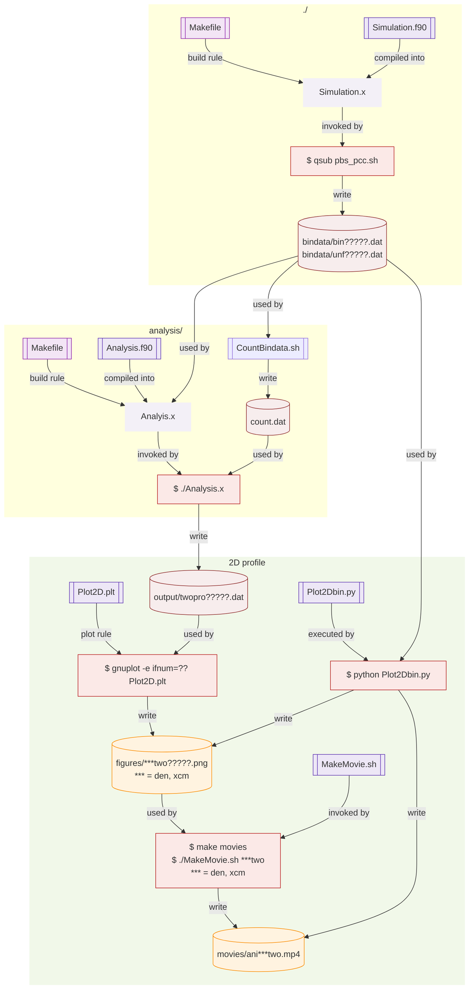

# 2D Rayleigh Taylor Instability in Blast wave 

[Go to top](../README.md)  

## How to run and analyse

This is the instruction for spring school of division of science.

### login and go to work directory 
First login the server, `m000.cfca.nao.ac.jp`.

    ssh <your account>@m000.cfca.nao.ac.jp
    
Then, go to work directory. Make it if that does not exist.

    mkdir /mwork2/<your account>
    cd /mwork2/<your account>

Copy the programs.　If you did not do it before. 
    
    cp -r /mwork2/dos31/RayleighTaylorInstability .
    
Keep the original program as it is.
    
    cd RayleighTaylorInstability/
    mv RTBWHYD2D RTBWHYD2D_original
   
### Making your model 
Start the simulation by copying the original file. You can name the directory as you like. `_model1` is an example.
    
    cp -r RTBWHYD2D_original RTBWHYD2D_model1
    cd RTBWHYD2D_model1

### compile 
To run the code, you need to compile `Simulation.f90`.
    
    module load intel
    make build
    
Then `Simulation.x`is made in this directory. `make Simulation.x` also works. You can know the command by `make help`.

### run
Let's run the code.
    
    qsub pbs_m000.sh
    
The simulation data is saved in `bindata/`.
    
    ls bindata/
    
### analysis
Open another terminal and go to analysis server, `an??.cfca.nao.ac.jp`. Here ?? is 09-14. To analyze the data, let us make `Analysis.x`.
    
    ssh <your account>@an??.cfca.nao.ac.jp
    
Then go to the work directory. Change `_model1` to the name you used.

    cd /mwork2/<your account>/RayleighTaylorInstability/RTBWHYD2D_models/analysis .
    make Analysis.x
    
Now you have many time-snapshots of data. To count it, use a script.
    
    ./CountBindata.sh
   
See the file, `cat control.dat`. You can know the number of files.
Then preparation is done. Run the analyis.
    
    ./Analyis.x
    
The output is saved in `output/`.
### 2D plots and animation.

If you need 2D snapshots, use the following command. Using `output/twopro*.dat` (2D Pofile), image files are made and save as `figures/*.png` (e.g., `dentwo00050.png`).
    
    gnuplot rttpro.plt
    ls figures/
    display figures/dentwo00050.png
    
All snapshots are made by the following command. 
    
    make 2Dsnaps
   
To make movie from the files. Type as follows.

    make movies
   
The movie files in saved in `movies/`. You can see the movie with the following command.

    ls movies/
    mplayor movies/ani???.mp4
    
### Do all of them
To do all in one command, you just type `make` or `make all`.
   
      make all
      
If you want th delete all the analysis, type `make allclean`.

# Graphical Summary

We show a graphical summary of the data analysis pipeline.

